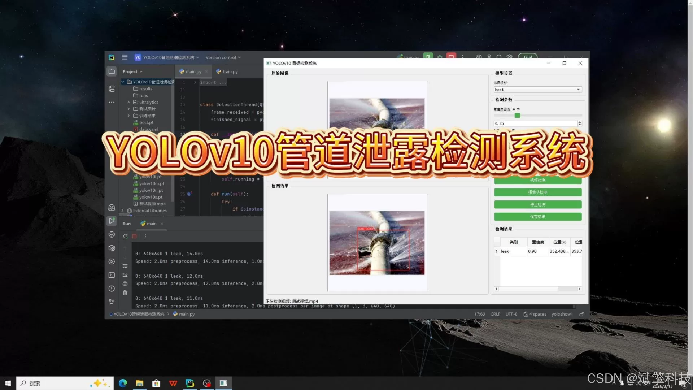
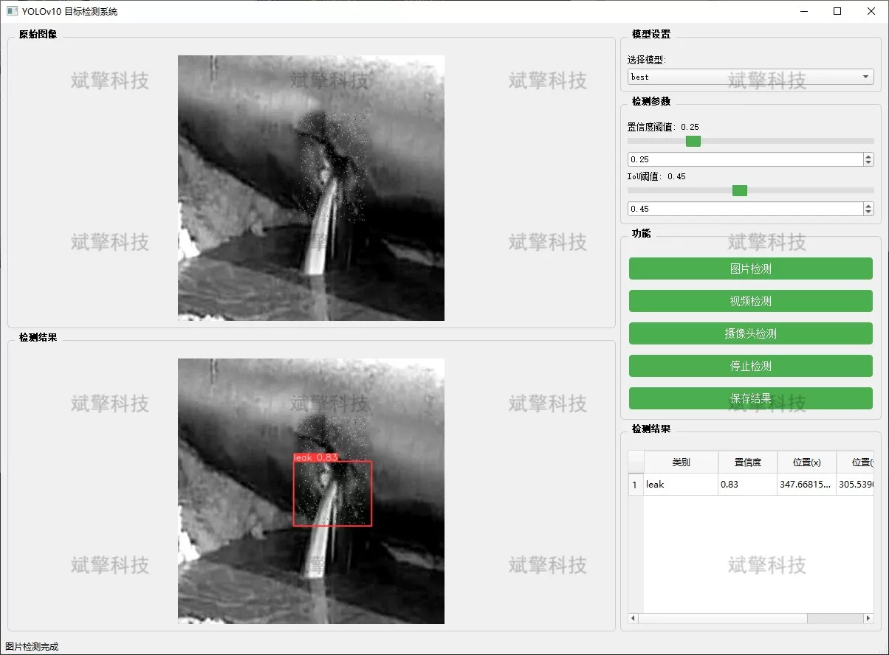
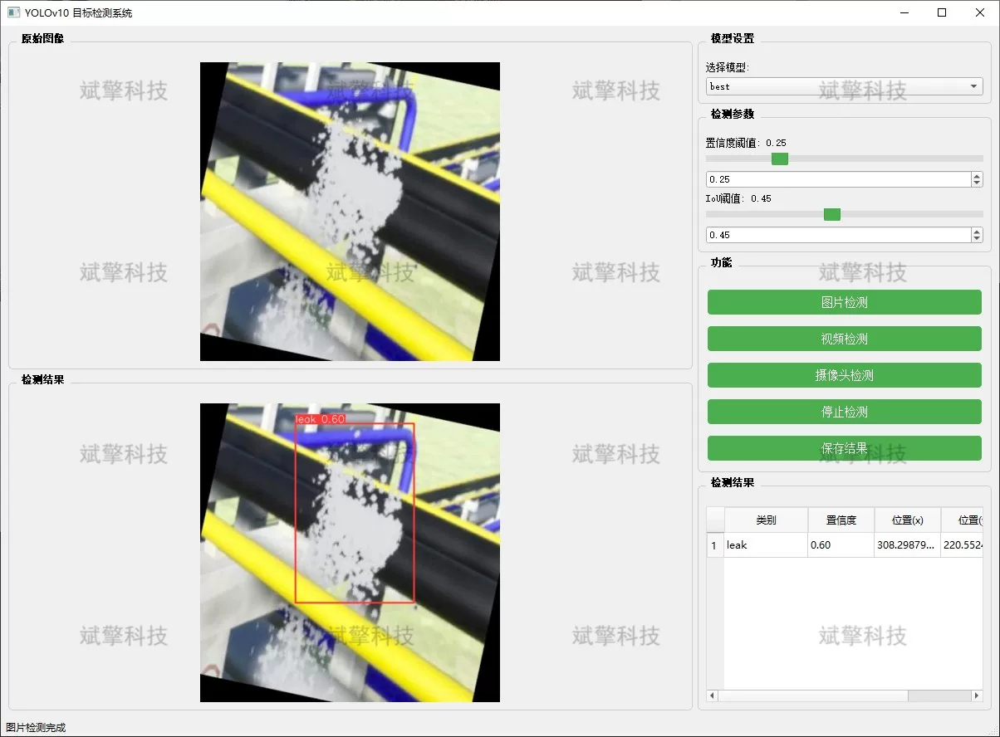
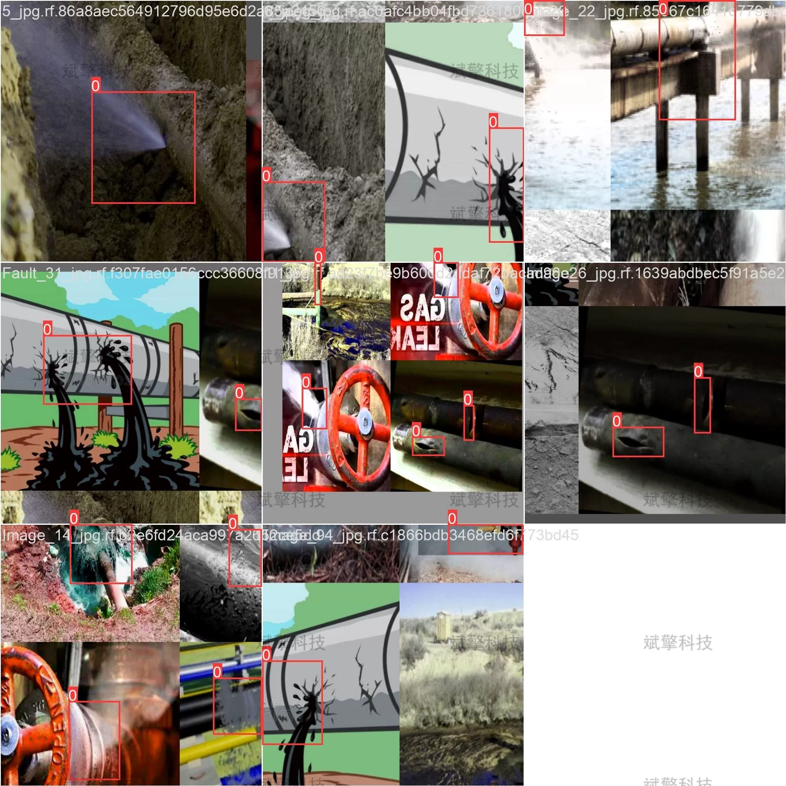

# YOLOv10 pipeline leak detection system

## Body

YOLOv10 Pipeline Leakage Detection System Based on YOLOv10 Deep Learning (YOLOv10+YOLO dataset + UI interface + Python project + Model)

As industrial pipeline transportation systems become increasingly complex, pipeline leak accidents not only cause significant economic losses but may also lead to severe environmental pollution and safety incidents. To achieve rapid and accurate identification of pipeline leaks, this study proposes an intelligent pipeline leak detection system based on the YOLOv10 deep learning model.
This system is optimized for the characteristics of minor leaks in pipeline scenarios, featuring three core functions: image detection, real-time video detection, and real-time camera monitoring. Experimental results show that the model performs exceptionally well on a homemade pipeline leakage dataset, effectively extracting leak features from complex backgrounds and achieving end-to-end real-time detection. This system provides efficient and reliable technical support for the intelligent operation and maintenance of industrial pipelines, holding important theoretical research value and broad application prospects.
Based on the latest YOLOv10 object detection algorithm, this project has constructed a complete intelligent pipeline leak detection system. As the latest evolution of the YOLO series, YOLOv10 maintains high detection speed while further improving detection accuracy and small object recognition capabilities, especially suitable for detecting fine-grained targets such as minor pipeline leaks.

System Features

✅ Image Detection: Can be used to detect images, returning detection boxes and category information.

✅ Video Detection: Supports input of video files, detecting each frame in the video.

✅ Real-time Camera Monitoring: Connects USB cameras to achieve real-time monitoring.

✅ Parameter Real-Time Adjustment (Confidence and IoU Thresholds)

Dataset Introduction

Training set: A total of 3481 images
Validation set: A total of 911 images

## Images

## Payment

Here is a pay link on Stripe ( https://buy.stripe.com/3cs8yP7sY87d0vu9AB ). Please contact me lonlonago@foxmail.com after funding $89, and I will send you a complete data files , thank you!

